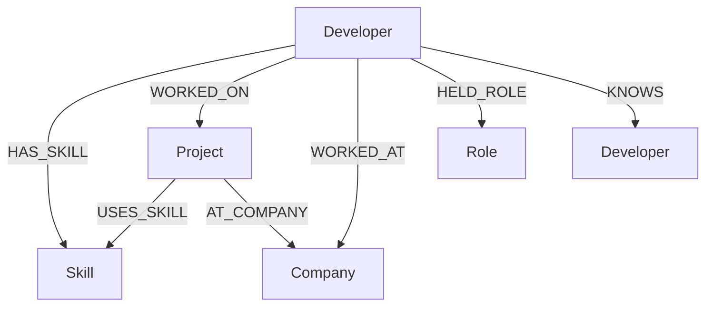

# Developer Skill & Career Graph

Full-stack CognoDB take-home project for WEXA AI.

## Use case
Explore relationships between developers, skills, projects, companies and roles.

## Why a graph database?
The core questions are relationship-heavy: developer -> skill -> project -> skill, shared skills between developers, and career/company paths. A relational implementation would require several join tables and increasingly complex multi-join queries. Graph traversal expresses these relationships directly.

## Model


## Stack
React + Vite | Django REST Framework | official Neo4j Python driver | CognoDB | React Force Graph.

## Structure
```text
backend/
  config/
  cypher/
    schema.cypher
    queries.cypher
  graph/
    management/commands/seed_graph.py
    services/cognodb.py
    services/queries.py
    views.py
    urls.py
frontend/
  src/
    components/
    pages/
    services/
docs/
docker/
Dockerfile
docker-compose.yml
```

## Setup

Create separate environment files for each application:

Copy `backend/.env.example` to `backend/.env` and `frontend/.env.example` to
`frontend/.env`, then replace the placeholder values.

`backend/.env`
```env
COGNODB_URI=bolt+s://<instance-id>.databases.cognodb.cloud
COGNODB_USER=cognodb
COGNODB_PASSWORD=<password>
DJANGO_SECRET_KEY=change-me
DJANGO_DEBUG=True
CORS_ALLOWED_ORIGINS=http://localhost:5173
```

`frontend/.env`
```env
VITE_API_BASE_URL=http://127.0.0.1:8000/api
```

Backend:
```bash
cd backend
python -m venv venv
venv\Scripts\activate
pip install -r requirements.txt
python manage.py migrate
python manage.py seed_graph
python manage.py runserver 8000
```

Frontend:
```bash
cd frontend
npm install
npm run dev
```


Docker (runs the API at `http://localhost:8000` and the web app at `http://localhost:5173`):
```bash
docker compose up --build
```

## API
`GET /api/health/`
`GET /api/developers/`
`GET /api/developers/<id>/`
`GET /api/skills/`
`GET /api/projects/`
`GET /api/search/?q=python`
`GET /api/graph/developer/<id>/`
`GET /api/recommendations/<id>/`

## Graph requirements demonstrated
- Seed script with realistic data.
- Parameterized Cypher.
- Multi-hop traversal: Developer -> Skill -> Project -> Skill.
- Graph-native recommendation: developers sharing skills.
- Relationship path query in `backend/cypher/queries.cypher`.
- Graceful CognoDB connection errors.
- Secrets read only from environment variables.

## Deployment
See `docs/DEPLOYMENT.md`.

## Recording
See `docs/SCREEN_RECORDING_SCRIPT.md`.

Replace the demo URL and screenshots after deployment.
